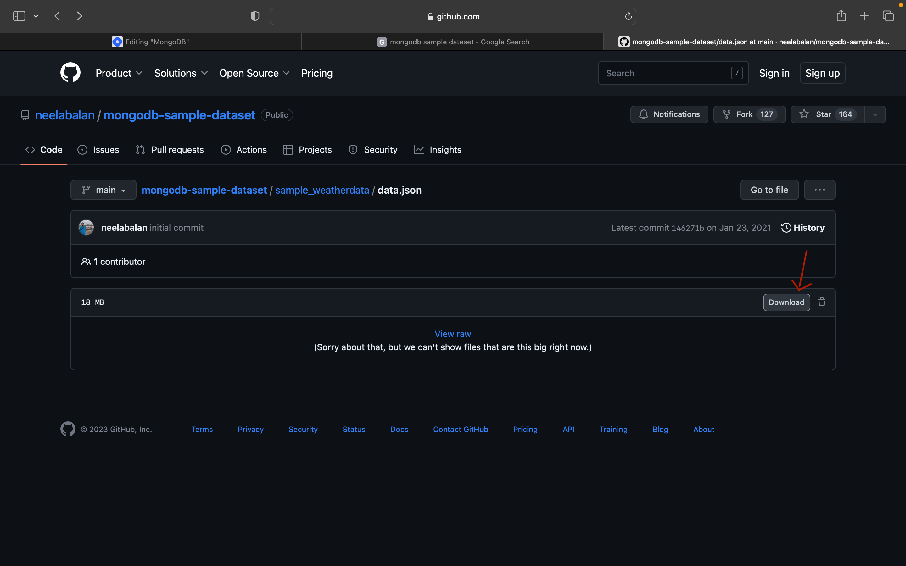

(1). show databases; //show dbs;

(2). ```use collection_Name;``` // To create and select new dataBase if it is not created/to select dataBase if it is already created.

(3). ```show collections;```

(4). ```db.createCollection("name_of_the_collection");``` // This will create a new collection.

(5). ```db.collectionName.insertOne({key1: value1, key2: value2 ....})``` // This is used to insert/add a new record to a collection.(i.e, This will add only one collection at a time.)

(6). ```db.collectionname.find();``` // This will all the collections.

(7). ```db.collectionName.insertMany([{key1: value1,key2: value2},{key1: value1,key2: value2,key3: value3},{key1: value1,key2: value2,key3: value3,key4: value4}])``` // To add multiple records at once in MongoDB we can use array(i.e, [{key1: value1,key2: value2},{key1: value1,key2: value2,key3: value3},{key1: value1,key2: value2,key3: value3,key4: value4}]).


# (Q). Can we add an array in the JSON of MongoDB?
=> We can simply use [] to add an array in the JSON of MongoDB.

(8). `db.User.insertOne({ Name: "MummyJi" , children: ["Araham", "Arefa", "Aatefa"] })` // can simply use [] to add an array in the JSON of MongoDB.

# (Q). How to see the count of documents in a collection?
=> There is a count() function that we use see the count of documents in a collection.

(9). `db.collectin_name.find().coun()` => This will print the count of documents in a collection.

# (Q). How to import data in mongoDB without MongoDB Compass?

To get some free sample datasets you can check out this Github link:

[ling to get free sample dataset ](https://github.com/neelabalan/mongodb-sample-dataset)

You can pick any folder and download the dataset which is present in JSON format.



After the file is downloaded you can import this data using your `linux terminal`.

- We can use a terminal or CMD to import data without a compass.
- Open your terminal or CMD.
- Change the directory to the one where you have downloaded the `data.json` file.(This is for linux)
```bash
cd Downloads
```

### Step 1: Install Docker on Raspberry Pi
Run the following commands:

```bash
curl -fsSL https://get.docker.com -o get-docker.sh
sh get-docker.sh
```

Then, **add your user to the Docker group** to run Docker without `sudo`:
```bash
sudo usermod -aG docker $USER
```

**Restart your Raspberry Pi** for the changes to take effect:

```bash
sudo reboot
```

### Step 2: Verify Docker Installation
After rebooting, check if Docker is installed correctly:

```bash
docker --version
```

If it prints something like `Docker version XX.XX.XX`, Docker is installed successfully. 

### Step 3: Use Docker to Run `mongoimport` to mport the local json file into the mongodbAtlus(mongoDB cloud):
Now we can use a MongoDB tool called as `mongoimport` to import local data.json file onto the mongodb.

```bash
# Run a temporary MongoDB container to execute mongoimport
docker run --rm -it \  
  -v ~/Downloads:/data \  # Mount the local Downloads folder to /data inside the container
  mongo:latest \  # Use the latest MongoDB Docker image
  mongoimport \  # Run the mongoimport tool inside the container

  --uri "mongodb+srv://<User_Name>:<yourpassword>@cluster0.5xaojev.mongodb.net" \  # MongoDB Atlas connection string (replace '<yourpassword>' with the actual password & <User_Name> wih mongodb_user_name)
  --db my_database \  # Specify the target database name where you want to store the json-file(data.json).
  --collection new_weather_data \  # Specify the target collection_name where data will be inserted
  --file /data/data.json  # Path to the JSON file inside the container (mapped from ~/Downloads), Here `data.json` is the json file that we want to import on the mongoDB dataBase.
```
