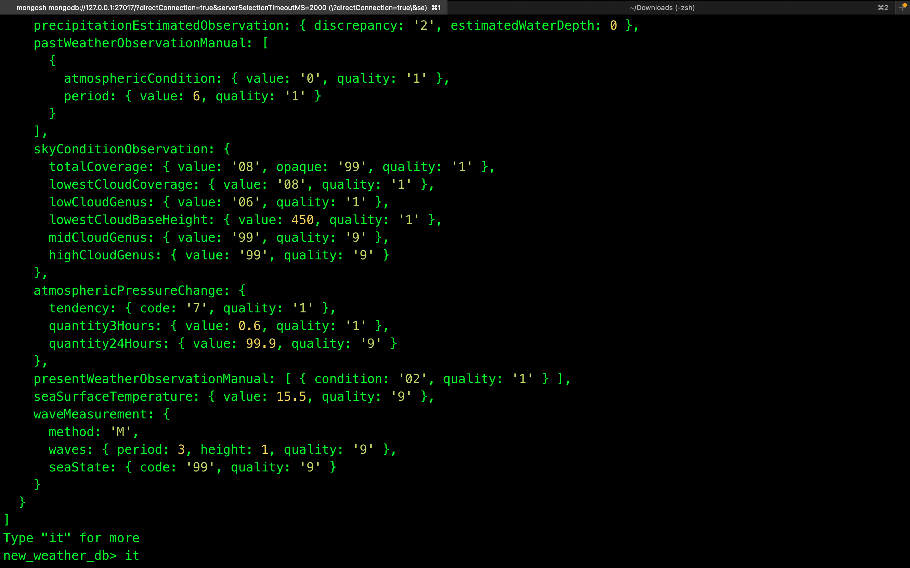

(1). show databases; //show dbs;

(2). ```use collection_Name;``` // To create and select new dataBase if it is not created/to select dataBase if it is already created.

(3). ```show collections;```

(4). ```db.createCollection("name_of_the_collection");``` // This will create a new collection.

(5). ```db.collectionName.insertOne({key1: value1, key2: value2 ....})``` // This is used to insert/add a new record to a collection.(i.e, This will add only one collection at a time.)

(6). ```db.collectionname.find();``` // This will all the collections.

(7). ```db.collectionName.insertMany([{key1: value1,key2: value2},{key1: value1,key2: value2,key3: value3},{key1: value1,key2: value2,key3: value3,key4: value4}])``` // To add multiple records at once in MongoDB we can use array(i.e, [{key1: value1,key2: value2},{key1: value1,key2: value2,key3: value3},{key1: value1,key2: value2,key3: value3,key4: value4}]).


# (Q). Can we add an array in the JSON of MongoDB?
=> We can simply use [] to add an array in the JSON of MongoDB.

(8). `db.User.insertOne({ Name: "MummyJi" , children: ["Araham", "Arefa", "Aatefa"] })` // can simply use [] to add an array in the JSON of MongoDB.

# (Q). How to import data in mongoDB without MongoDB Compass?

To get some free sample datasets you can check out this Github link:

[ling to get free sample dataset ](https://github.com/neelabalan/mongodb-sample-dataset)

You can pick any folder and download the dataset which is present in JSON format.


After the file is downloaded you can import this data using your `linux terminal`.

- We can use a terminal or CMD to import data without a compass.
- Open your terminal or CMD.
- Change the directory to the one where you have downloaded the `data.json` file.(This is for linux)
```bash
cd Downloads
```

### Step 1: Install Docker on Raspberry Pi
Run the following commands:

```bash
curl -fsSL https://get.docker.com -o get-docker.sh
sh get-docker.sh
```

Then, **add your user to the Docker group** to run Docker without `sudo`:
```bash
sudo usermod -aG docker $USER
```

**Restart your Raspberry Pi** for the changes to take effect:

```bash
sudo reboot
```

### Step 2: Verify Docker Installation
After rebooting, check if Docker is installed correctly:

```bash
docker --version
```

If it prints something like `Docker version XX.XX.XX`, Docker is installed successfully. 

### Step 3: Use Docker to Run `mongoimport` to mport the local json file into the mongodbAtlus(mongoDB cloud):
Now we can use a MongoDB tool called as `mongoimport` to import local data.json file onto the mongodb.

```bash
# Run a temporary MongoDB container to execute mongoimport
docker run --rm -it \  
  -v ~/Downloads:/data \  # Mount the local Downloads folder to /data inside the container
  mongo:latest \  # Use the latest MongoDB Docker image
  mongoimport \  # Run the mongoimport tool inside the container

  --uri "mongodb+srv://<User_Name>:<yourpassword>@cluster0.5xaojev.mongodb.net" \  # MongoDB Atlas connection string (replace '<yourpassword>' with the actual password & <User_Name> wih mongodb_user_name)
  --db my_database \  # Specify the target database name where you want to store the json-file(data.json).
  --collection new_weather_data \  # Specify the target collection_name where data will be inserted
  --file /data/data.json  # Path to the JSON file inside the container (mapped from ~/Downloads), Here `data.json` is the json file that we want to import on the mongoDB dataBase.
```

## Let's explore the DB we imported

# 9.(Q). How to see the count of documents in a collection?

There is a `count()` function that we can use t count the documents.

```bash
db.collectionName.find().count();
```

# 10.(Q). How to handle the printing of huge amounts of data?

If you have a huge amount of data, just like we have here approx 10,000 documents, if you try to execute db.collectionName.find in your mongosh then will not print all the 10,000 records, becuase it cannot handle that in the shell. If you try it then in the console, it will print some data and then gives you a prompt of Try "it" for more.


If you write it and press enter then you will get next group of data.




# 11.(Q). How to get a certain number of documents?

We can use a function called as `.limit(no_of_records_to_fetch)`.

```bash
db.collectionName.find().limit(no_of_records_to_fetch);
```

# 12.(Q). How to set an `offset` while querying data?

We can set an offset using the skip function. Using the `skip()` function we can skip some records and then start fetching records post the skip.

```bash
db.collectionName.find().skip(5).limit(3)  # Skips the first 5 documents and retrieves up to 3 documents
```

# 12.(Q). How to filter the records while querying data?

To filter the records, we can pass an object in the arguments of the `find()` function, where we can add out conditions.

```bash
db.collectionName.find({key1: value1, key2: value2})
```

example : `db.new_weather_data.find({type: 'FM-13'}).count();`

# 13. Projections 
If we want to not get all the properties of the JSON, and instead get some specific key-value pairs, this process is called Projection. In the world of SQL, if you do SELECT * FROM TABLE; then you get all the columns but if you do SELECT name, address FROM TABLE; you only get name and address. This 
same thing is achieved in Projections.

### `How to do projections?`

So the first argument of the find function is an object which takes filtration criteria. It can accept another argument as an object, where we can write whatever properties we have to include and assign them a value true.

```bash
db.collectionName.find({filter1: value1...}, {property1: true, property2: true....});
```

example:
(a) `db.new_weather_data.find({type: 'FM-13'}, {position: true, visibility: true});` => Ye sirf wahi ke documents ka `psition` aur `visibility` fields ko dega  dega jisme `type: 'FM-13'` key-value pairs ho.

(b).You can also pass the first argument as an empty JSON object. 
`db.new_weather_data.find({}, {position: true, visibility: true});`=>

(c).  If we want to manually exclude specific properties, you can write their names with false value allocated:
`db.new_weather_data.find({}, {skyConditionObservation: false, pastWeatherObservationManual: false});`=> Now this will bring everything apart from `pastWeatherObservationManual` and `skyConditionObservation`.

# 14. How to `delete some document`?
If we want to delete some documents we can use functions like `deleteOne()` , `deleteMany()` and `findByIdAndDelete()` .


### (a). `deleteOne()`
```bash
db.collectionName.deleteOne({filter1: value1, filter2:value2..});
```

example: 
`db.new_weather_data.deleteOne({st :"x+43400-065600"});` => this will delete the one document from the `new_weather_data` which is having `{st :"x+43400-065600"}` key-value pairs.

### (b). `deleteMany()`
```bash
db.collectionName.deleteMany({filter1: value1, filter2: value2..});
```

example:
`db.new_weather_data.deleteMany({callLetters:'FNPG'});` => This will delete all the documents which is having `{callLetters:'FNPG'}` key-value pairs.

### (c). `findOneAndDelete()`
```
db.new_weather_data.findOneAndDelete({ _id: ObjectId("Id_that_you_want_to_delete") });
```

example:
`db.new_weather_data.findOneAndDelete({ _id: ObjectId("5553a998e4b02cf7151190dc") });` => This will delete one documents which is having `_id: ObjectId("5553a998e4b02cf7151190dc"`.


# 15. How to `update a record`?

To Update records we can use `updateOne` , `updateMany` and a few similar
functions. These functions take `two arguments` which are as follows :---

(a). first argument is Filtration criteria viz. how to filter what data to update.
(b). second argument is With what values we should update.(and befor using the second argument we mus have to use mongoDB_operator`$operator`)

```bash
db.collectionName.updateOne({filter1: value1}, {$operator:{key1: value1, key2: value2...}})
```

Now MongoDB provides us some operators for these updates for example:
- $set -> This will allocate the value to the key directly passed in the object.
- $inc -> This will increment the value in the key.

